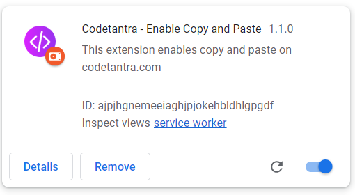

# Codetantra - Enable Copy and Paste

This extension enables copy and paste on codetantra.com

## Installation
1. Clone/download as zip and extract the repository.
2. Open chrome://extensions/ in your browser.
3. Enable developer mode.
4. Click on Load unpacked and select the folder where you extracted the repository.

<<<<<<< Updated upstream

=======

>>>>>>> Stashed changes

## How to use

## Built With

* [Chrome Extension](https://developer.chrome.com/extensions) - The web framework used

## License
This project is licensed under the MIT License - see the LICENSE.md file for details
